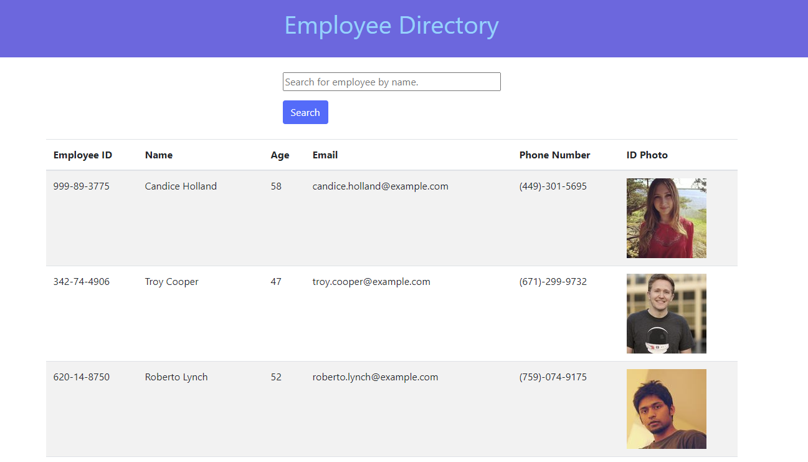

# Employee Directory


### Click [here](https://ajhami.github.io/employee_dir/) to visit deployed application.

## Description
This Application is a simple employee directory, designed to demonstrate the implementation of a simple React.js application.



## Table of Contents
- Installation / Setup
- Usage

### Installation / Setup
```git
npm install
```
### Usage
This application was built to keep track of earnings and expenses. Users simply type in the title of a transaction and the dollar amount, then select to add or subtrack funds. The transaction will then be inserted into the graphic below. This application will function both when connected to the internet and when working offline.


*© 2020 ajhami - Alexander James Hamilton. All Rights Reserved.*
